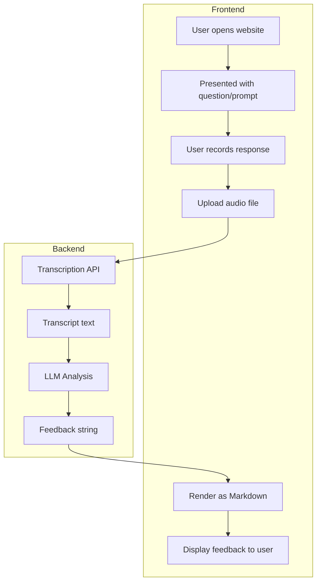

# Comms Coach

A communication coaching tool that provides AI-powered feedback on your spoken responses.

https://github.com/user-attachments/assets/2246e2f5-4aee-48fe-b860-52bccb94c0f9

## How It Works

1. You talk
2. Your words are transcribed
3. An LLM gives you feedback based on communication best practices

## User Flow

1. User opens the website
2. User is presented with a question/prompt
3. User records their response and uploads the audio
4. Audio is sent to a transcription API
5. Transcript is passed to an LLM for analysis
6. LLM returns feedback as a string
7. Feedback is rendered as markdown and displayed to the user

## Communication Principles

The LLM evaluates responses against these criteria:

### Structure & Completeness

1. Does the response state the core point or answer in the first 1-2 sentences?
2. Does the speaker establish why this matters to the listener or what they'll gain within the first 1-2 sentences?
3. Does each sentence logically follow from the previous, without unexplained topic jumps?
4. Are tangents brought back to the main point (or avoided entirely)?
5. Does the response end cleanly with a summary, call to action, or decisive close (not trailing off, "thank you," or "any questions")?
6. For multi-part questions: are all parts addressed?
7. Is anything critical omitted that would change the listener's understanding?
8. Does the response answer the actual question asked (not an adjacent or easier question)?

### Clarity & Precision

9. Are abstract claims grounded in concrete examples or specifics?
10. Are vague quantifiers ("a lot," "some," "many," "often") replaced with specifics when available?
11. Is jargon avoided or explained when used?
12. Is vocabulary and technicality appropriate for the audience?

### Conciseness

13. Could the same point be made in 50% fewer words?
14. Are filler words (um, uh, like, you know, I mean, basically, actually, literally, so, right) avoided?
15. Are hedge phrases (I think, I guess, maybe, kind of, sort of, I feel like) minimized or replaced with direct statements?
16. Are deadweight words (very, really, quite, pretty, somewhat, honestly, frankly) avoided?
17. Is permission-seeking language (I was wondering, if you don't mind, sorry but) avoided?

### Delivery

18. Is the speech rate between 140-160 wpm? (Flag if sustained >180 or <120)
19. Does pace vary appropriately for emphasis, or is it monotone throughout?
20. Does pitch and volume vary, or is delivery flat?
21. Are pauses used strategically for emphasis?
22. Do statements end cleanly (no upspeak or trailing off)?
   
