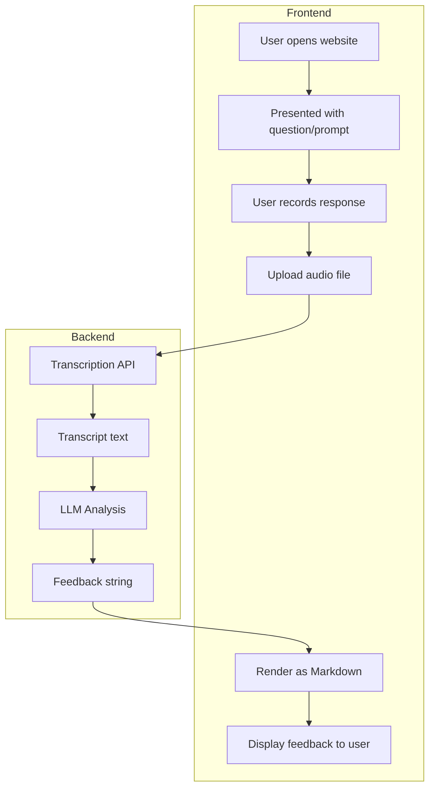

# Comms Coach

A communication coaching tool that provides AI-powered feedback on your spoken responses.

## How It Works

1. You talk
2. Your words are transcribed
3. An LLM gives you feedback based on communication best practices

## User Flow

1. User opens the website
2. User is presented with a question/prompt
3. User records their response and uploads the audio
4. Audio is sent to a transcription API
5. Transcript is passed to an LLM for analysis
6. LLM returns feedback as a string
7. Feedback is rendered as markdown and displayed to the user

   